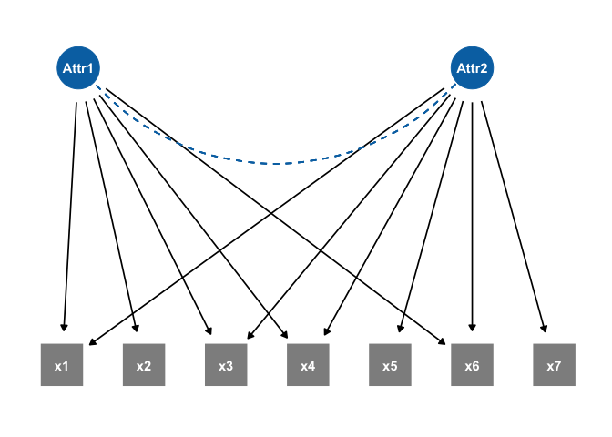
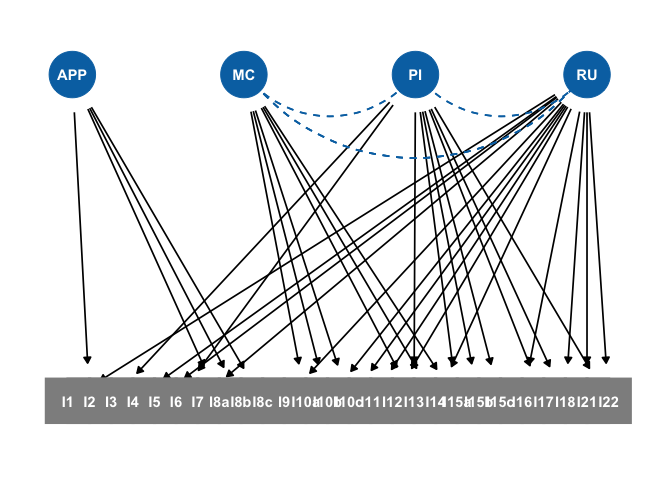

# ggdcm

[](https://www.tidyverse.org/lifecycle/#experimental)

## Usage

``` r
library(ggdcm)
#> Loading required package: ggplot2
library(tidyverse)
#> ── Attaching packages ─────────────────────────────────────────────────────────────────── tidyverse 1.3.0 ──
#> ✓ tibble  3.0.1     ✓ dplyr   1.0.0
#> ✓ tidyr   1.1.0     ✓ stringr 1.4.0
#> ✓ readr   1.3.1     ✓ forcats 0.5.0
#> ✓ purrr   0.3.4
#> ── Conflicts ────────────────────────────────────────────────────────────────────── tidyverse_conflicts() ──
#> x dplyr::filter() masks stats::filter()
#> x dplyr::lag()    masks stats::lag()
library(dagitty)
library(ggdag)
#> 
#> Attaching package: 'ggdag'
#> The following object is masked from 'package:stats':
#> 
#>     filter
dag.dcm  <- dagify(
 x1 ~ Attr1 + Attr2,
 x2 ~ Attr1,
 x3 ~ Attr1 + Attr2,
 x4 ~ Attr2 + Attr1,
 x5 ~ Attr2,
 x6 ~ Attr2 + Attr1,
 x7 ~ Attr2,
 labels = c(Attr1 = "Multiplication", Attr2 = "Minus")
)
ggdcm(.tdy_dag = dag.dcm, use_labels = "label", int.vars = paste0("x", 1:7))
#> Latent Variables' Names Automate Generated!
```



``` r
dtmrSyntax = dagify(
I1 ~ RU,
I2 ~ APP,
I3 ~ PI,
I4 ~ RU,
I5 ~ RU,
I6 ~ PI,
I7 ~ RU,
I8a ~ APP,
I8b ~ APP,
I8c ~ APP,
I9 ~ RU,
I10a ~ MC,
I10b ~ RU + MC,
I10c ~ RU + MC,
I11 ~ RU,
I12 ~ RU,
I13 ~ PI + MC,
I14 ~ RU + MC,
I15a ~ PI + MC,
I15b ~ PI,
I15c ~ PI,
I16 ~ RU,
I17 ~ PI,
I18 ~ RU + PI,
I21 ~ RU,
I22 ~ RU + PI

)

int.varsname <- c( "I1", "I2", "I3", "I4", "I5", "I6", "I7", "I8a", "I8b", "I8c", "I9", "I10a", "I10b", "I10c", "I11", "I12", "I13", "I14", "I15a", "I15b", "I15c", "I16", "I17", "I18", "I21", "I22" )

ggdcm(.tdy_dag = dtmrSyntax, int.vars = int.varsname)
#> Latent Variables' Names Automate Generated!
```


